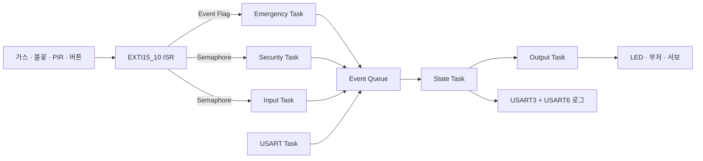

# RTOS 기반 스마트홈 안전 시스템

NUCLEO-F439ZI와 **μC/OS-III**를 이용해 구현한 스마트홈 안전 시스템입니다. 가스 누출과 화재는 재실 여부와 관계없이 상시 감시하며, 외출 모드에서는 전력을 차단하고 PIR 센서로 침입을 감지합니다. 위험 이벤트는 일반 입출력보다 높은 우선순위로 처리하고, 경보 내용을 PC 시리얼 터미널과 HC-06 블루투스에 동시에 전송합니다.

임베디드시스템 과목 텀프로젝트로 제작했습니다.

## 시연 영상

| 시연 | 영상 |
| --- | --- |
| 전체 시스템 구현 및 동작 | [YouTube에서 보기](https://youtu.be/GNV0TqFYVas) |
| 화재 감지 | [YouTube에서 보기](https://youtu.be/-5QERB4Wvo8) |
| 가스 누출 감지 | [YouTube에서 보기](https://youtu.be/RZ1jg1sFpzQ) |
| 외출 중 침입 감지 | [YouTube에서 보기](https://youtu.be/5T_DL-hAvsA) |

## 주요 기능

### 가스 누출 대응

- MQ 가스 센서의 디지털 출력을 EXTI 인터럽트로 감지
- 능동 부저 경보
- 가스 차단 및 전력 차단 상태를 2색 LED로 시연
- PC와 블루투스 연결 단말기에 비상 로그 전송

### 화재 대응

- 불꽃 감지 센서의 디지털 출력을 EXTI 인터럽트로 감지
- 능동 부저 경보 및 전력 차단 상태 표시
- SG90 서보 모터가 30°와 150°를 왕복하며 스프링클러 동작 모사
- PC와 블루투스 연결 단말기에 비상 로그 전송

### 외출 모드와 침입 감지

- USER 버튼 또는 시리얼 명령으로 `HOME`과 `OUT` 모드 전환
- `OUT` 진입 시 전력 차단 상태 표시
- `OUT` 모드에서만 PIR 입력을 침입으로 처리
- PIR 감지 후 800 ms 동안 신호가 유지되는지 재확인하여 센서 튐 방지
- 침입 발생 시 부저 경보 및 원격 알림 전송

### 페일세이프 비상 해제

- 비상 상태에서 버튼 또는 `clear` 명령으로 해제 요청
- 가스·불꽃 센서 값을 다시 확인하여 위험이 사라진 경우에만 이전 모드로 복귀
- 위험 신호가 유지 중이면 해제 요청 거부

## 시스템 동작

시스템은 `HOME`, `OUT`, `EMERGENCY`의 세 가지 상태로 동작합니다.

| 현재 상태 | 입력 | 결과 |
| --- | --- | --- |
| `HOME` | 버튼 또는 `out` | `OUT` 전환, 전력 차단 표시 |
| `OUT` | 버튼 또는 `home` | `HOME` 전환, 전력 정상 표시 |
| `HOME` / `OUT` | 가스 또는 불꽃 감지 | `EMERGENCY` 전환 및 원인별 대응 |
| `OUT` | PIR 감지 | 침입 `EMERGENCY` 전환 |
| `HOME` | PIR 감지 | 거주자의 정상 활동으로 간주하고 무시 |
| `EMERGENCY` | 버튼 또는 `clear` | 위험 해소 시 직전 상태로 복귀 |

인터럽트 서비스 루틴은 신호 게시만 수행하고 즉시 반환합니다. 센서 판정과 상태 전환, 출력 제어는 각각의 태스크에서 처리하여 긴급 이벤트가 로그 출력이나 일반 입력 처리 때문에 지연되지 않도록 구성했습니다.

## μC/OS-III 태스크 구성

우선순위 값이 작을수록 높은 우선순위를 가집니다. Start 태스크는 초기화를 마친 뒤 삭제되므로 정상 운용 중에는 7개의 기능 태스크가 실행됩니다.

| 태스크 | 우선순위 | 실행 방식 / 대기 객체 | 역할 |
| --- | ---: | --- | --- |
| Start | 2 | 시작 시 1회 | 주변장치, 커널 객체, 기능 태스크 생성 후 자가 삭제 |
| Emergency | 3 | Event Flag | 가스·불꽃 감지 및 비상 이벤트 래치 |
| Security | 4 | Semaphore | `OUT` 모드의 PIR 침입 판정 |
| Input | 5 | Semaphore | 버튼 디바운스와 모드 전환·비상 해제 요청 |
| State | 6 | Message Queue | 상태 머신과 이벤트 직렬 처리 |
| USART | 7 | 20 ms 폴링 | 시리얼 명령 수신 및 해석 |
| Output | 8 | 200 ms 주기 | LED, 부저, 서보 출력 갱신 |
| Monitor | 9 | 100 ms 주기 | PIR 원시 신호 변화 로깅 |

사용한 주요 RTOS 객체는 다음과 같습니다.

- **Event Flag**: 가스와 불꽃 이벤트를 하나의 Emergency 태스크에 전달
- **Semaphore**: PIR 및 USER 버튼 인터럽트를 각 처리 태스크에 전달
- **Message Queue**: 여러 입력에서 발생한 상태 전환 요청을 State 태스크에서 순서대로 처리
- **Mutex**: 공유 상태인 현재 모드 보호
- **Critical Section**: State 태스크 처리 전 발생할 수 있는 중복 비상 이벤트 방지

## 하드웨어 구성 및 핀맵

| 구분 | 부품 / 신호 | 보드 핀 | 동작 |
| --- | --- | --- | --- |
| 입력 | MQ 가스 센서 D0 | PF12 (D8), EXTI12 | Active LOW, 하강 엣지 |
| 입력 | 불꽃 감지 센서 DO | PF15 (D2), EXTI15 | 상승 엣지 |
| 입력 | PIR 인체 감지 센서 DO | PF14 (D4), EXTI14 | Active HIGH, 상승 엣지 |
| 입력 | USER 버튼 B1 | PC13, EXTI13 | 하강 엣지, 50 ms 디바운스 |
| 출력 | 전력 상태 2색 LED | PB8 (빨강), PB9 (초록) | 차단 / 정상 상태 표시 |
| 출력 | 가스 상태 2색 LED | PA6 (빨강), PA7 (초록) | 차단 / 정상 상태 표시 |
| 출력 | 능동 부저 | PE13 (D3) | Active LOW 경보 |
| 출력 | SG90 서보 모터 | PE9, TIM1_CH1 | 50 Hz PWM, 스프링클러 모사 |
| 통신 | PC 시리얼 | PD8 / PD9, USART3 | 115200 bps, 8-N-1 |
| 통신 | HC-06 블루투스 | PG9 / PG14, USART6 | 9600 bps, 8-N-1 |

> MQ 계열 센서와 SG90은 보드의 GPIO 허용 전압 및 공급 전류를 확인해 배선해야 합니다. 필요하면 별도 전원과 공통 GND를 사용하세요.

## 상태별 출력

| 상태 / 원인 | 전력 LED | 가스 LED | 부저 | 서보 |
| --- | --- | --- | --- | --- |
| `HOME` | 초록 | 초록 | OFF | 0° |
| `OUT` | 빨강 | 초록 | OFF | 0° |
| 가스 비상 | 빨강 | 빨강 | ON | 0° |
| 화재 비상 | 빨강 | 초록 | ON | 30° ↔ 150° |
| 침입 비상 | 빨강 | 초록 | ON | 0° |

## 시리얼 명령

USART3 터미널에서 다음 명령을 입력할 수 있습니다. 각 명령은 줄바꿈(`CR` 또는 `LF`)으로 실행합니다.

| 명령 | 설명 |
| --- | --- |
| `home` | HOME 모드 전환 요청 |
| `out` | OUT 모드 전환 요청 |
| `clear` | 비상 해제 요청 |
| `status` | 현재 모드와 센서·버튼·명령 카운터 출력 |
| `help` | 사용 가능한 명령 출력 |

`AppTrace()` 로그는 USART3와 USART6으로 동시에 전송되므로 PC 터미널과 블루투스 단말기에서 같은 이벤트를 확인할 수 있습니다.

## 소스 코드

현재 저장소는 시스템의 핵심 애플리케이션 소스인 [`app.c`](./app.c)를 제공합니다. 이 파일에는 다음 구현이 포함되어 있습니다.

- μC/OS-III 초기화, 커널 객체 및 태스크 생성
- GPIO·EXTI·TIM1 PWM·USART3·USART6 설정
- 센서 ISR과 태스크 간 동기화
- `HOME` / `OUT` / `EMERGENCY` 상태 머신
- LED·부저·서보 출력과 시리얼·블루투스 로그

실행하려면 NUCLEO-F439ZI용 BSP와 μC/OS-III가 구성된 프로젝트에 `app.c`를 포함한 뒤, 위 핀맵에 맞게 센서와 출력 장치를 연결하여 빌드·플래시합니다. BSP 또는 스타터 프로젝트의 USART, 클록, 인터럽트 설정이 다르다면 해당 설정을 환경에 맞게 조정해야 합니다.

## 테스트 시 참고 사항

- MQ 가스 센서는 가변저항으로 임계값을 조절하고, 평상시 HIGH·감지 시 LOW가 되는지 먼저 확인합니다.
- 불꽃 센서는 적외선에 반응하므로 주변 조명에 의해 오검출될 수 있습니다. 설치 환경에 맞게 감도를 조절합니다.
- PIR 센서는 전원 인가 후 안정화 시간이 필요할 수 있습니다.
- 비상 해제가 되지 않는 경우 가스·불꽃 입력이 실제로 정상 레벨로 돌아왔는지 확인합니다.

## 팀

- 이효진
- 강태희
